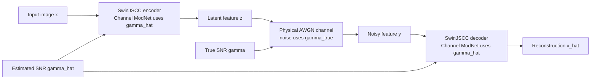

# Imperfect-CSI SwinJSCC: Robust Semantic Image Transmission under SNR Mismatch

## Abstract

Adaptive neural JSCC improves semantic image transmission by conditioning source-channel representations on channel quality, but existing SwinJSCC evaluation assumes that the SNR used by Channel ModNet equals the true physical SNR. This letter formulates an imperfect-CSI setting by decoupling the true channel SNR and the estimated modulation SNR. An uncertainty-aware training objective is then introduced by perturbing the estimated SNR during training. CIFAR10/AWGN results show that the proposed uncertainty-aware training improves off-diagonal mismatch PSNR by 1.92 dB with only 0.09 dB average matched-SNR degradation.

Index Terms--Semantic communications, deep joint source-channel coding, SwinJSCC, imperfect CSI, SNR mismatch.

## I. Introduction

Deep joint source-channel coding (Deep JSCC) has become a representative neural approach for wireless image transmission because it directly maps source samples to channel symbols and avoids the strict interface between compression and error-control coding [1], [3]. This property is attractive for semantic communications, where end-to-end reconstruction quality or task utility is more relevant than bit-level recovery [8], [9]. Recent image-oriented JSCC systems further improve adaptability through feedback, bandwidth agility, OFDM transmission, attention modules, and nonlinear transform coding [4]-[7], [10].

SwinJSCC extends this line of work by replacing CNN-based backbones with a Swin Transformer architecture and by using channel/rate modulation modules to adapt latent representations to different SNRs and channel bandwidth ratios [11], [12]. The adaptation mechanism, however, relies on a subtle but consequential assumption: the SNR supplied to Channel ModNet is the same SNR that determines the physical channel noise. In a practical wireless link, CSI is usually estimated from pilots, feedback, or prediction. The estimated SNR may deviate from the true physical SNR due to noise, delay, or mobility. Under this mismatch, an adaptive JSCC encoder may allocate semantic features according to an incorrect channel condition.

This letter studies SwinJSCC under imperfect CSI. The true channel SNR, denoted by \(\gamma\), controls the AWGN corruption. The estimated SNR, denoted by \(\hat{\gamma}\), controls the encoder and decoder modulation. Fig. 1 illustrates this decoupled system. When \(\hat{\gamma}=\gamma\), the model reduces to the conventional perfect-CSI setting. When \(\hat{\gamma}\ne\gamma\), the same architecture is evaluated under SNR mismatch.

The contribution is threefold. A practical imperfect-CSI SwinJSCC formulation is introduced without changing the SwinJSCC backbone. An uncertainty-aware training objective is formulated by sampling bounded SNR estimation errors. A true-SNR by estimated-SNR evaluation matrix is used to quantify off-diagonal robustness, revealing whether adaptation remains reliable when CSI is imperfect. In addition to the framework diagram in Fig. 1, the experimental section reserves a mismatch heatmap analysis. Fig. 2 will visualize the original SwinJSCC PSNR matrix under all \(\gamma\times\hat{\gamma}\) pairs, making the fragility of the perfect-CSI assumption visible before comparing the proposed training strategy.

## II. System Model and Problem Formulation

Let \(\mathbf{x}\in[0,1]^{3\times H\times W}\) be an input image. A neural encoder maps it to a real-valued latent tensor,
\[
\mathbf{z}=F_{\theta}(\mathbf{x},\hat{\gamma},C),
\tag{1}
\]
where \(\theta\) denotes trainable parameters, \(C\) is the bottleneck dimension or rate control variable, and \(\hat{\gamma}\) is the SNR used by the modulation network. Following the implementation, the real latent tensor is normalized before real-to-complex pairing. Let adjacent real components be paired into \(s_k=z_{2k-1}+jz_{2k}\). With unit average complex transmit power, the normalized channel input can be written as
\[
\mathbf{s}=\frac{\mathbf{z}_{\rm pair}}{\sqrt{2\mathbb{E}[\mathbf{z}^{2}]}}.
\tag{2}
\]
The factor of two follows from pairing two real latent components into one complex symbol. Under balanced real and imaginary components, this gives \(\mathbb{E}[|s_k|^2]=1\).
For an AWGN channel with true SNR \(\gamma\), the received symbol is
\[
\mathbf{y}=\mathbf{s}+\mathbf{n},\qquad
\mathbf{n}=\mathbf{n}_{\rm R}+j\mathbf{n}_{\rm I},
\tag{3}
\]
where
\[
\mathbf{n}_{\rm R},\mathbf{n}_{\rm I}\sim
\mathcal{N}\left(0,\sigma_{\rm R}^{2}\mathbf{I}\right),
\qquad
\sigma_{\rm R}^{2}=\frac{1}{2\cdot10^{\gamma/10}}.
\tag{4}
\]
Equivalently, the complex noise power is \(\mathbb{E}[|\mathbf{n}|^2]=1/10^{\gamma/10}\). This convention matches the implemented AWGN channel, where the real and imaginary noise components are sampled independently with variance \(\sigma_{\rm R}^{2}\).
The decoder reconstructs the image using the noisy feature and the estimated modulation SNR,
\[
\hat{\mathbf{x}}=G_{\theta}(\mathbf{y},\hat{\gamma}).
\tag{5}
\]

The original adaptive SwinJSCC evaluation implicitly assumes perfect CSI:
\[
\hat{\gamma}=\gamma.
\tag{6}
\]
Its expected distortion risk can therefore be written as
\[
\mathcal{R}_{\rm p}(\theta)=
\mathbb{E}_{\mathbf{x},\gamma}
\left[
d\left(G_{\theta}(T_{\gamma}(F_{\theta}(\mathbf{x},\gamma,C)),\gamma),\mathbf{x}\right)
\right],
\tag{7}
\]
where \(T_{\gamma}(\cdot)\) denotes channel corruption and \(d(\cdot,\cdot)\) is the reconstruction distortion.

In the imperfect-CSI setting, the receiver or transmitter observes an estimated SNR
\[
\hat{\gamma}=\mathrm{clip}(\gamma+e,\gamma_{\min},\gamma_{\max}),
\tag{8}
\]
where \(e\) is the estimation error. The deployment risk becomes
\[
\mathcal{R}_{\rm imp}(\theta)=
\mathbb{E}_{\mathbf{x},\gamma,e}
\left[
d\left(G_{\theta}(T_{\gamma}(F_{\theta}(\mathbf{x},\hat{\gamma},C)),\hat{\gamma}),\mathbf{x}\right)
\right].
\tag{9}
\]
If \(\Pr(e\ne0)>0\), (7) is a degenerate special case of (9) rather than the correct deployment objective. This mismatch is the central problem addressed in this letter.

## III. Imperfect-CSI SwinJSCC

The proposed implementation keeps the original SwinJSCC encoder, decoder, and Channel ModNet. The only functional change is the separation of the SNR argument into two roles. The physical channel receives \(\gamma\), while the encoder and decoder modulation branches receive \(\hat{\gamma}\). This design preserves compatibility with pretrained SwinJSCC checkpoints, because setting \(\hat{\gamma}=\gamma\) recovers the original inference path.

The uncertainty-aware training objective samples a true SNR from the configured training set and then perturbs the estimated SNR:
\[
\gamma\sim\mathcal{S},\qquad
e\sim\mathcal{U}[-\Delta,\Delta],\qquad
\hat{\gamma}=\mathrm{clip}(\gamma+e,\gamma_{\min},\gamma_{\max}).
\tag{10}
\]
For a mini-batch \(\mathcal{B}\), the empirical objective is
\[
\widehat{\mathcal{R}}_{\rm UA}(\theta)=
\frac{1}{|\mathcal{B}|}
\sum_{\mathbf{x}_i\in\mathcal{B}}
d\left(G_{\theta}(T_{\gamma_i}(F_{\theta}(\mathbf{x}_i,\hat{\gamma}_i,C)),\hat{\gamma}_i),\mathbf{x}_i\right).
\tag{11}
\]
When \(\Delta=0\), (11) collapses to perfect-CSI training. When \(\Delta>0\), the model is optimized over a local neighborhood of estimated channel states.

This objective can be understood as local risk smoothing over the estimated CSI input. Define
\[
H_{\theta}(\mathbf{x},\gamma,e)=
G_{\theta}(T_{\gamma}(F_{\theta}(\mathbf{x},\gamma+e,C)),\gamma+e).
\tag{12}
\]
If \(H_{\theta}\) and \(d\) are locally Lipschitz with respect to \(e\), then there exists a constant \(K_{\theta}\) such that
\[
\left|d(H_{\theta}(\mathbf{x},\gamma,e),\mathbf{x})
-d(H_{\theta}(\mathbf{x},\gamma,0),\mathbf{x})\right|
\le K_{\theta}|e|.
\tag{13}
\]
Perfect-CSI training controls only the point \(e=0\), whereas (11) optimizes the average distortion over a bounded error interval. The argument does not imply pointwise superiority for every \((\gamma,\hat{\gamma})\), nor does it prove robustness for arbitrary model capacity or error distributions. It only establishes that the UA objective is statistically aligned with an imperfect-CSI deployment distribution, while the perfect-CSI objective is aligned with the degenerate case \(e=0\).

Fig. 1. Imperfect-CSI SwinJSCC framework. The physical channel is governed by the true SNR \(\gamma\), while the encoder and decoder modulation networks are conditioned on the estimated SNR \(\hat{\gamma}\).

## IV. Experimental Results

The experiments use CIFAR10 over an AWGN channel with \(C=32\). The true and estimated SNR values are both selected from \(\mathcal{S}=\{1,4,7,10,13\}\) dB. The baseline is the original SwinJSCC `w/_SA` CIFAR10/AWGN/C32 checkpoint. The UA model uses the same architecture and is initialized from the corresponding original CIFAR10/AWGN/C32 checkpoint. The reported UA result uses \(\Delta=3\) dB, \(\gamma_{\min}=1\) dB, and \(\gamma_{\max}=13\) dB in (10). The CIFAR10 training configuration uses batch size 256, Adam optimizer, learning rate \(10^{-4}\), and random seed 42. [TODO-CHECK] Before submission, record the exact fine-tuning epoch and command line that produced `ua_delta3_cifar10_awgn_C32_msssim_cpu.csv`; the current manuscript treats the available CSV as a single-seed result. The distortion metrics are PSNR, MS-SSIM, and MS-SSIM(dB), where
\[
\mathrm{PSNR}=10\log_{10}\frac{255^2}{\mathrm{MSE}},
\tag{14}
\]
and
\[
\mathrm{MS\text{-}SSIM}_{\rm dB}
=-10\log_{10}(1-\mathrm{MS\text{-}SSIM}).
\tag{15}
\]

To quantify imperfect-CSI robustness, define a mismatch matrix
\[
\mathbf{P}_{i,j}=\mathrm{PSNR}(\gamma_i,\hat{\gamma}_j),
\tag{16}
\]
where diagonal entries \(i=j\) correspond to matched CSI and off-diagonal entries correspond to SNR mismatch. The off-diagonal average is
\[
\overline{P}_{\rm off}=
\frac{1}{N(N-1)}\sum_{i\ne j}\mathbf{P}_{i,j}.
\tag{17}
\]

[TODO-FIG] Fig. 2 should report the original SwinJSCC PSNR heatmap \(\mathbf{P}^{\rm orig}\) over the full \(\gamma\times\hat{\gamma}\) grid. This figure uses real data from `original_cifar10_awgn_C32_msssim_cpu.csv` and should be used as the motivation figure for SNR mismatch fragility. [TODO-FIG] Fig. 3 should report the gain heatmap \(\mathbf{P}^{\rm UA}-\mathbf{P}^{\rm orig}\), using `ua_delta3_cifar10_awgn_C32_msssim_cpu.csv` and the original CSV. These figures should be exported as vector graphics before submission.

Table I reports the main aggregate results. The proposed UA training improves the off-diagonal average PSNR from 29.8782 dB to 31.7947 dB, giving a gain of 1.9164 dB. The diagonal average changes from 34.9688 dB to 34.8771 dB, a reduction of only 0.0917 dB. These results indicate that robustness under SNR mismatch can be improved without materially degrading matched-SNR performance on the tested CIFAR10/AWGN/C32 setting.

Table I

Aggregate mismatch performance on CIFAR10/AWGN/C=32.

| Condition | Original PSNR | UA PSNR | Delta PSNR | Delta MS-SSIM |
|---|---:|---:|---:|---:|
| Off-diagonal average | 29.8782 | 31.7947 | +1.9164 | +0.0290 |
| Diagonal average | 34.9688 | 34.8771 | -0.0917 | -- |

Table II lists representative mismatch cases. The largest observed gain occurs at \(\gamma=1\) dB and \(\hat{\gamma}=7\) dB, where PSNR improves by 4.7989 dB. This case corresponds to overestimating a poor physical channel. The original modulation policy is then likely to under-protect the latent representation, while UA training has exposed the model to nearby SNR estimation errors.

Table II

Representative PSNR gains under SNR mismatch.

| True SNR | Estimated SNR | Original PSNR | UA PSNR | Gain |
|---:|---:|---:|---:|---:|
| 1 | 7 | 18.5161 | 23.3151 | +4.7989 |
| 13 | 1 | 30.9903 | 35.4478 | +4.4575 |
| 1 | 4 | 24.9906 | 29.1104 | +4.1198 |
| 4 | 10 | 24.6440 | 28.5768 | +3.9328 |
| 10 | 1 | 31.0376 | 34.7060 | +3.6684 |

The MS-SSIM trend is consistent with the PSNR result. Across off-diagonal entries, the UA model increases average MS-SSIM by 0.0290. For \(\gamma=1\) dB and \(\hat{\gamma}=7\) dB, MS-SSIM increases from 0.7259 to 0.8850. These results support the claim that imperfect-CSI training improves not only pixel-level fidelity but also perceptual structural similarity on the tested CIFAR10/AWGN setting.

### A. Qualitative Reconstruction Plan

[TODO-FIG] Fig. 4 should compare reconstructed images under representative mismatch cases using the layout: original image, original SwinJSCC mismatch reconstruction, and UA mismatch reconstruction. The recommended cases are \((\gamma=1,\hat{\gamma}=7)\), \((\gamma=4,\hat{\gamma}=10)\), and \((\gamma=13,\hat{\gamma}=1)\). The existing `mismatch_vis_cifar10` directory may have been overwritten by different checkpoints and should not be used directly for the final comparison. The final figure should be regenerated into separate directories, such as `mismatch_vis_cifar10_original/` and `mismatch_vis_cifar10_ua_delta3/`, to prevent checkpoint mixing.

### B. Ablation and Baseline Plan

The current comparison isolates imperfect-CSI training against the original SwinJSCC checkpoint, but additional baselines are required before submission. Table III lists required experiments that are not yet available. They are included as placeholders only and must not be interpreted as completed results.

Table III

[TODO-TABLE] Required ablations and additional baselines before submission.

| Study | Purpose | Planned setting | Current status |
|---|---|---|---|
| Delta ablation | Test sensitivity to uncertainty radius | [TODO-RUN] \(\Delta\in\{0,1,3,6\}\) dB | Missing |
| Matched-only fine-tuning | Separate checkpoint fine-tuning from UA benefit | [TODO-RUN] same checkpoint/epochs, but \(\hat{\gamma}=\gamma\) | Missing |
| Conservative SNR conditioning | Compare against a simple robust heuristic | [TODO-RUN] condition ModNet on a conservative or clipped SNR estimate | Missing |
| No-SA/no-Channel-ModNet baseline | Test dependence on modulation/attention when checkpoint exists | [TODO-RUN] evaluate if compatible checkpoints are available | Missing |

[LIMITATION] Until Table III is populated, the present evidence supports the narrower claim that the implemented UA training improves the measured mismatch matrix against the available original SwinJSCC `w/_SA` checkpoint. It does not yet prove that bounded estimated-CSI perturbation is superior to every simpler augmentation or fine-tuning baseline.

The scope of the current evaluation is limited to CIFAR10/AWGN/C=32. The experiments do not yet include Rayleigh fading, high-resolution datasets, variable CBR settings, repeated seeds, or completed ablations over \(\Delta\). These studies are necessary before claiming general robustness across semantic image transmission scenarios.

## V. Conclusion

This letter reformulates adaptive SwinJSCC under imperfect CSI by decoupling the physical channel SNR from the SNR used by Channel ModNet. The resulting uncertainty-aware objective trains the model over bounded SNR estimation errors and better matches deployment conditions where CSI feedback is imperfect. On CIFAR10/AWGN/C=32, the method improves average off-diagonal mismatch PSNR by 1.92 dB while preserving matched-SNR performance. Future work will extend the evaluation to fading channels, high-resolution image transmission, rate adaptation, and explicit uncertainty modeling.

## References

[1] C. E. Shannon, "A mathematical theory of communication," Bell Syst. Tech. J., vol. 27, no. 3, pp. 379-423, Jul. 1948.

[2] T. M. Cover and J. A. Thomas, Elements of Information Theory, 2nd ed. Hoboken, NJ, USA: Wiley, 2006.

[3] E. Bourtsoulatze, D. B. Kurka, and D. Gunduz, "Deep joint source-channel coding for wireless image transmission," IEEE Trans. Cogn. Commun. Netw., vol. 5, no. 3, pp. 567-579, Sep. 2019.

[4] D. B. Kurka and D. Gunduz, "DeepJSCC-f: Deep joint source-channel coding of images with feedback," arXiv:1911.11174, 2019.

[5] D. B. Kurka and D. Gunduz, "Bandwidth-agile image transmission with deep joint source-channel coding," IEEE Trans. Wireless Commun., vol. 20, no. 12, pp. 8081-8095, Dec. 2021.

[6] M. Yang and H.-S. Kim, "Deep joint source-channel coding for wireless image transmission with OFDM," in Proc. IEEE ICC, 2021, pp. 1-6.

[7] J. Xu, B. Ai, W. Chen, A. Yang, P. Sun, and M. Rodrigues, "Wireless image transmission using deep source channel coding with attention modules," IEEE Trans. Circuits Syst. Video Technol., vol. 32, no. 4, pp. 2315-2328, Apr. 2022.

[8] H. Xie, Z. Qin, G. Y. Li, and B.-H. Juang, "Deep learning enabled semantic communication systems," IEEE Trans. Signal Process., vol. 69, pp. 2663-2675, 2021.

[9] H. Xie, Z. Qin, G. Y. Li, and B.-H. Juang, "Deep learning based semantic communications: An initial investigation," in Proc. IEEE GLOBECOM, 2020, pp. 1-6.

[10] J. Dai, S. Wang, K. Tan, Z. Si, X. Qin, K. Niu, and P. Zhang, "Nonlinear transform source-channel coding for semantic communications," IEEE J. Sel. Areas Commun., vol. 40, no. 8, pp. 2300-2316, Aug. 2022.

[11] K. Yang, S. Wang, J. Dai, X. Qin, K. Niu, and P. Zhang, "SwinJSCC: Taming Swin Transformer for deep joint source-channel coding," IEEE Trans. Cogn. Commun. Netw., 2024, doi: 10.1109/TCCN.2024.3424842.

[12] Z. Liu et al., "Swin Transformer: Hierarchical vision transformer using shifted windows," in Proc. IEEE/CVF ICCV, 2021, pp. 10012-10022.
